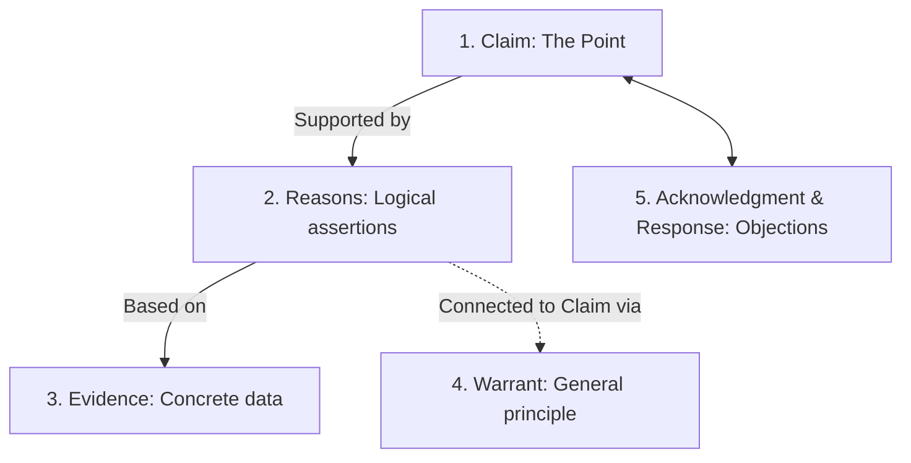

# Research Argument Model

**Summary**: A five-element conceptual model for constructing academic research arguments, framing the process as a collaborative conversation with the reader.

**Sources**: [Craft_of_Research_9780226826660.md](file:///home/chrislogann/Desktop/repository/llm-wiki/raw/Craft_of_Research_9780226826660.md)

**Last updated**: 2026-08-15

---

In *The Craft of Research*, a research argument is defined not as a hostile dispute, but as a structured conversation where the writer answers predictable questions on behalf of the reader (source: Craft_of_Research_9780226826660.md). The model consists of five key elements:

## The Five Elements

### 1. Claim
The **Claim** is the central point or thesis statement. It answers the reader's question: *"What do you want me to believe? What's your point?"*
- Claims must be specific, significant, and contestable.

### 2. Reasons
A **Reason** is a statement that leads the audience to accept a claim. It answers the question: *"Why do you say that? Why should I agree?"*
- Reasons are typically linked to claims using logical connectors like *because*.
- Reasons are sub-claims generated by the writer's own logic.

### 3. Evidence
**Evidence** is the bedrock data or information on which reasons are based. It answers the question: *"How do you know? Can you back it up?"*
- Unlike reasons (which are conceptual), evidence represents external, objective facts (e.g., statistics, quotes, experimental results).
- If reasons are not backed by evidence, the argument fails.

### 4. Warrant
A **Warrant** is a general principle that connects a specific reason to a specific claim. It answers the question: *"How does that follow? Can you explain your reasoning?"*
- Warrants are often implicit, but must be made explicit if the audience does not share the same assumptions.
- For detail, see [[warrants-in-arguments]].

### 5. Acknowledgment and Response
**Acknowledgment and Response** addresses the reader's skepticism. It answers the question: *"But what about...?"*
- A strong research argument anticipates objections, alternative explanations, and limitations, acknowledging them and offering a logical response.

## Related pages

- [[warrants-in-arguments]]
- [[craft-of-research]]
- [[academic-vs-intelligence-argumentation-comparison]]
